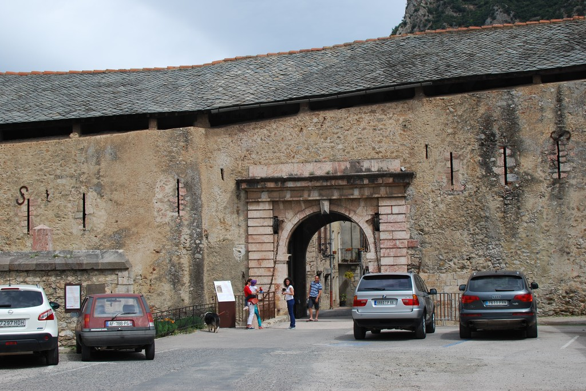
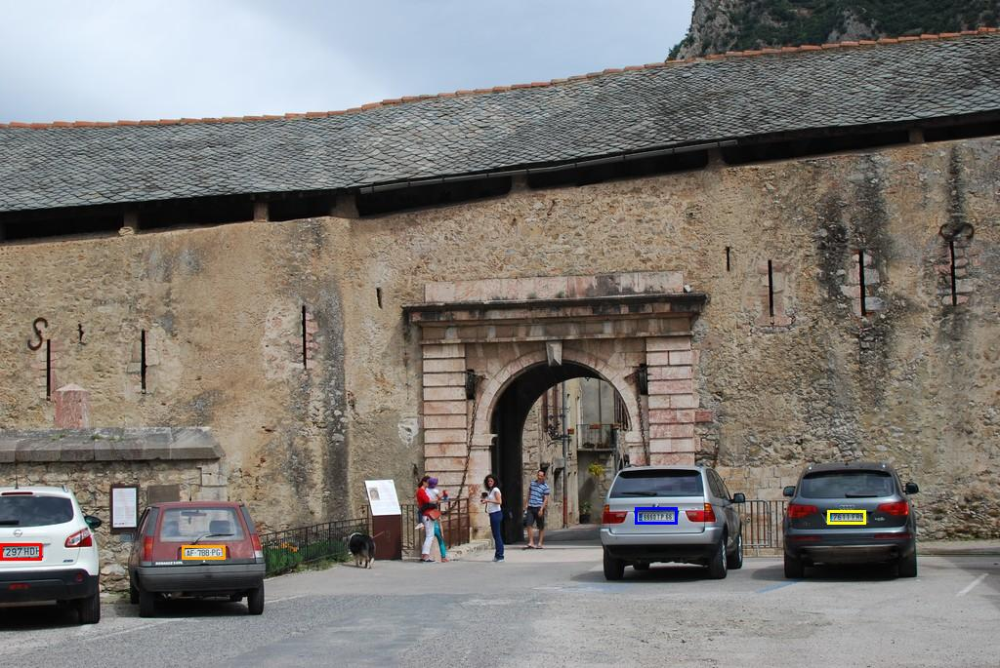
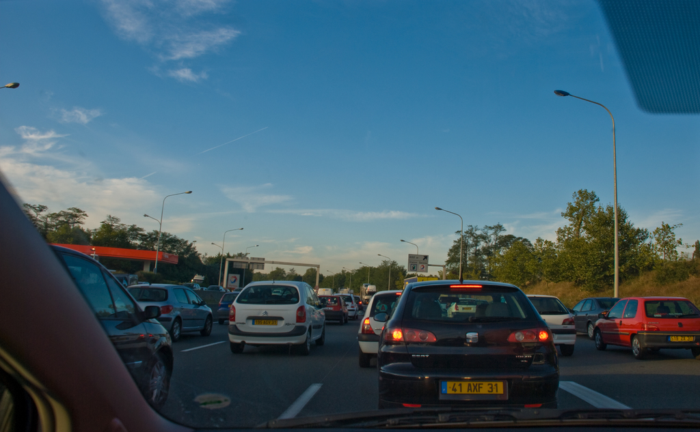
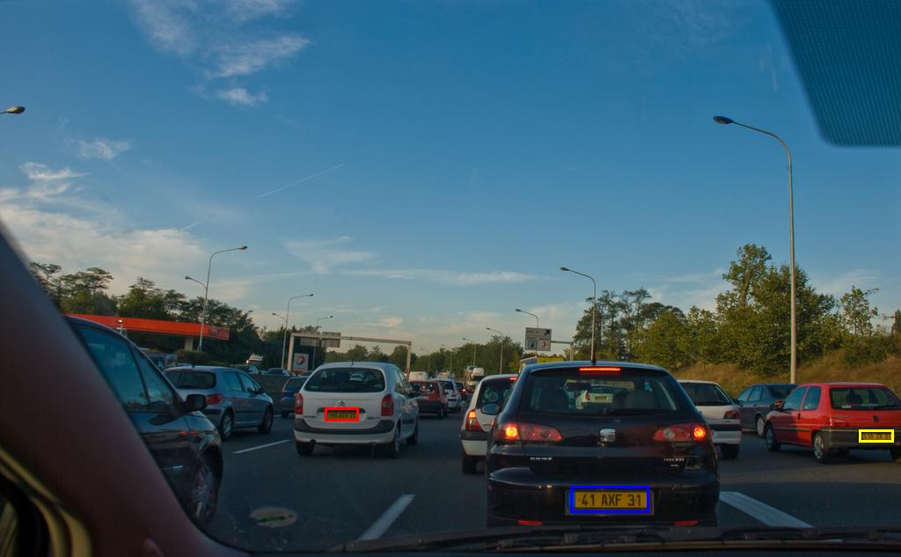
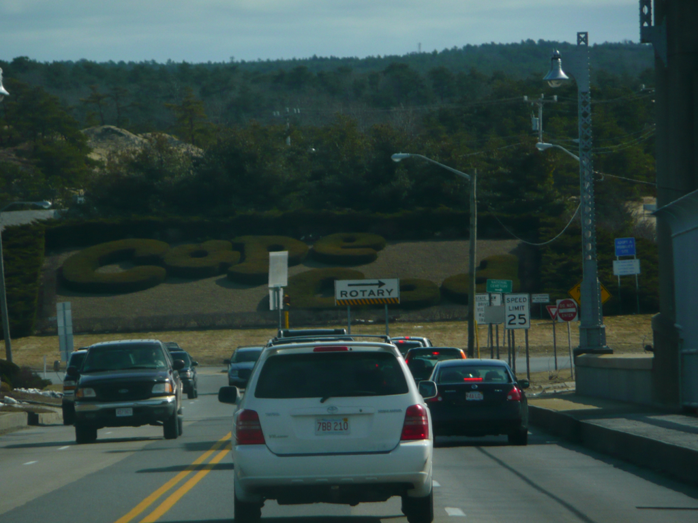

# License Plate Detection


This repo contains a PyTorch finetuning script for a Mask R-CNN model with a ResNet-50-FPN backbone (from the [Mask R-CNN paper](https://arxiv.org/abs/1703.06870)) on a [large dataset of license plates](https://www.kaggle.com/datasets/fareselmenshawii/large-license-plate-dataset/data).


## How to use
- ``` pip install -r requirements.txt```
#### Training:
- Download [dataset](https://www.kaggle.com/datasets/fareselmenshawii/large-license-plate-dataset/data)
- Clean dataset using ```dataset_scripts/clean_dataset.py ```
- ```python train.py```
#### Inference:
- ```python inference.py <path to model pickle file> <path to image>```

## Results
Original Image:

Detection:



Original Image:

Detection:



Original Image:

Detection:


## References
This code was adapted from this [tutorial](https://pytorch.org/tutorials/intermediate/torchvision_tutorial.html).